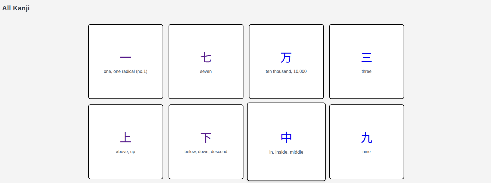
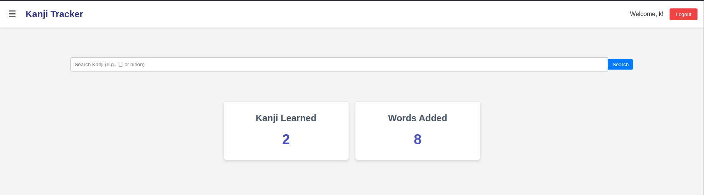
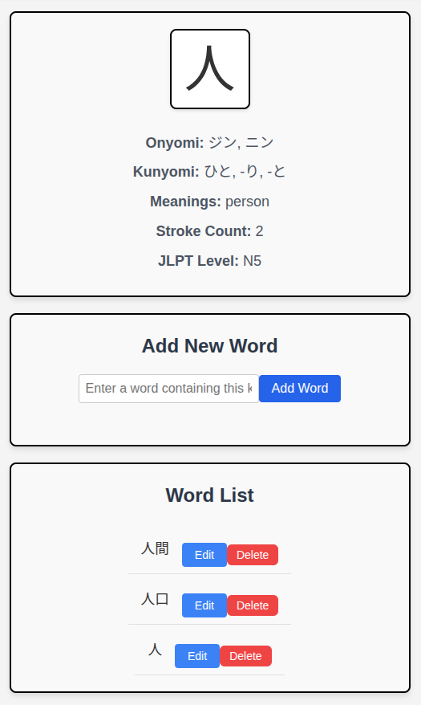

# Kanji Tracker

A web application designed to help Japanese language learners track their kanji and vocabulary progress. Built with React, Node.js, and PostgreSQL, this application provides an intuitive interface for learning and managing Japanese characters and words.

## Features

### Kanji Learning
- Browse through a comprehensive list of kanji characters
- Search kanji by character, reading, or meaning
- View detailed information for each kanji including:
  - Readings (onyomi and kunyomi)
  - Meanings
  - JLPT level
  - Stroke count
  - Example words

### Vocabulary Management
- Add vocabulary words for each kanji
- Track your progress with a minimum of 3 words per kanji
- Edit and delete words as needed
- View all your learned words in one place

### Progress Tracking
- Monitor your learning progress with statistics
- Track completed kanji (those with 3+ words)
- View total words learned
- JLPT level-based progress tracking

## Technology Stack

### Frontend
- React 18
- Vite
- React Router
- Tailwind CSS
- Context API for state management

### Backend
- Node.js with Express
- PostgreSQL database
- Jisho API integration for kanji and word validation
- JWT authentication

## Getting Started

### Prerequisites
- Node.js (v14 or higher)
- PostgreSQL (v12 or higher)
- npm or yarn

### Installation

1. Clone the repository:
   ```bash
   git clone https://github.com/yourusername/Kanji-Tracker.git
   cd Kanji-Tracker
   ```

2. Install dependencies:
   ```bash
   # Install frontend dependencies
   cd frontend
   npm install

   # Install backend dependencies
   cd ../backend
   npm install
   ```

3. Set up the database:
   ```bash
   # Create a PostgreSQL database
   createdb kanji_tracker

   # Run migrations
   npm run migrate
   ```

4. Configure environment variables:
   ```bash
   # In backend directory
   cp .env.example .env
   # Edit .env with your database credentials
   ```

5. Start the development servers:
   ```bash
   # Start backend server (from backend directory)
   npm run dev

   # Start frontend server (from frontend directory)
   npm run dev
   ```

## Screenshots

### Main Page

*Browse and search kanji characters*

### Kanji Detail Page

*View detailed kanji information and manage vocabulary*

### Word List

*Track your vocabulary progress*

## Contributing

Contributions are welcome. Please feel free to submit a Pull Request.

1. Fork the repository
2. Create your feature branch (`git checkout -b feature/AmazingFeature`)
3. Commit your changes (`git commit -m 'Add some AmazingFeature'`)
4. Push to the branch (`git push origin feature/AmazingFeature`)
5. Open a Pull Request

## License

This project is licensed under the MIT License - see the [LICENSE](LICENSE) file for details.

## Acknowledgments

- [Jisho API](https://jisho.org/) for kanji and word data